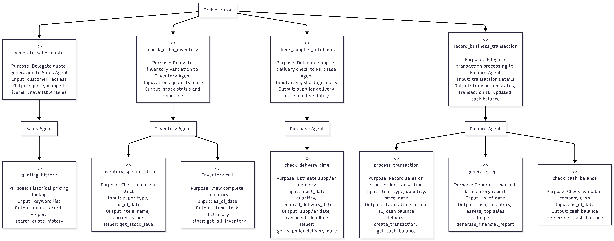

# Enterprise Multi-Agent Order Fulfillment System

An enterprise-style **Agentic AI** application that automates customer quote generation, inventory validation, supplier delivery planning, and financial transaction processing using a team of specialized AI agents.

The project demonstrates how multiple LLM-powered agents collaborate through **tool calling**, **SQL-backed business data**, and **workflow orchestration** to solve a realistic order fulfillment process.

---

# Overview

Modern order fulfillment requires multiple business departments to work together before an order can be confirmed. Rather than using a single AI assistant, this project adopts a **multi-agent architecture**, where each AI agent specializes in one business function while an Orchestrator coordinates the complete workflow.

The system can:

- Generate competitive customer quotations using historical pricing
- Validate inventory availability
- Estimate supplier delivery timelines
- Record financial transactions
- Reject infeasible customer orders with clear explanations

---

# System Architecture & Agent Workflow

The diagram below illustrates the overall multi-agent architecture, including the Orchestrator, worker agents, tool interactions, and helper functions.



The editable Mermaid workflow is available in:

```
Workflow_syntax_code_Mermaid.md
```

---

# Multi-Agent Architecture

The system consists of five specialized AI agents.

| Agent | Responsibility |
|--------|----------------|
| **Orchestrator Agent** | Coordinates the complete workflow and delegates tasks to worker agents |
| **Sales Agent** | Maps customer requests to catalog items, retrieves historical pricing, and generates competitive quotes |
| **Inventory Management Agent** | Validates inventory availability and calculates shortages |
| **Purchase Agent** | Estimates supplier delivery dates and verifies customer deadlines |
| **Finance Agent** | Records financial transactions, validates cash availability, and generates financial reports |

---

# End-to-End Workflow

The order fulfillment process follows these steps:

1. Customer submits a new order request.
2. The Orchestrator delegates quote generation to the Sales Agent.
3. Sales Agent:
   - Identifies requested products
   - Maps them to valid catalog items
   - Searches historical quotes
   - Generates a competitive quotation
4. Inventory Agent validates stock availability.
5. If inventory is insufficient:
   - Purchase Agent estimates supplier delivery.
   - Delivery feasibility is verified.
6. Finance Agent records stock-order and sales transactions when applicable.
7. The Orchestrator returns either:
   - Approved quotation
   - Delivery information
   - Transaction IDs
   - Order rejection with explanation

---

# Data Files

The project uses four CSV files, each serving a different purpose.

| File | Purpose |
|------|---------|
| **quote_requests.csv** | Historical customer requests stored in the SQLite database. Used by the Sales Agent when searching similar historical requests. |
| **quotes.csv** | Historical quotation records associated with previous customer requests. Used for pricing recommendations. |
| **quote_requests_sample.csv** | New customer requests used to evaluate the complete multi-agent workflow. Each request is processed through the Orchestrator. |
| **test_results.csv** | Generated automatically after running the evaluation. Stores the response, updated cash balance, and inventory value for every processed request. |

---

# Technologies

- Python
- SmolAgents
- OpenAI GPT-4o-mini
- SQLite
- SQLAlchemy
- Pandas
- Agentic AI
- Tool Calling
- Prompt Engineering

---

# Key Features

- Multi-Agent AI Architecture
- LLM Tool Calling
- Historical Quote Analysis
- Inventory Validation
- Supplier Delivery Planning
- Financial Transaction Processing
- SQL Database Integration
- Explainable Order Approval & Rejection
- Automated Workflow Evaluation

---

# Repository Structure

```
.
├── Multi_Agent_Order_Fulfillment.py
├── README.md
├── Workflow.png
├── Workflow_syntax_code_Mermaid.md
├── quote_requests.csv
├── quotes.csv
├── quote_requests_sample.csv
├── test_results.csv
```

---

# Example Results

## Successful Order

```
Quoted Amount: $99.00

Fulfillment Decision:
Order Fulfilled

Sales Transaction IDs:
23
24
25

Stock-order Transaction IDs:
26
27
```

---

## Rejected Order

```
Order rejected because the supplier cannot meet the required delivery date.

No financial transactions were created.
```

---

# Running the Project

Clone the repository.

Install the required dependencies.

Run:

```bash
python Multi_Agent_Order-Fulfillment.py
```

The evaluation automatically processes every request contained in:

```
quote_requests_sample.csv
```

and exports the results to:

```
test_results.csv
```

---

# Evaluation

The project evaluates the multi-agent system using a dataset of simulated customer requests.

The evaluation verifies:

- Quote generation
- Historical pricing retrieval
- Inventory validation
- Supplier delivery estimation
- Financial transaction recording
- Automatic rejection of infeasible customer requests

The complete evaluation output is available in:

```
test_results.csv
```

---

# Future Improvements

- Semantic product matching using vector embeddings
- Multi-supplier optimization based on delivery time and purchasing cost
- Dynamic pricing based on demand and inventory levels
- Parallel processing for large multi-item orders
- Integration with enterprise ERP systems such as SAP or Microsoft Dynamics

---

# Skills Demonstrated

- Agentic AI
- Multi-Agent Systems
- LLM Tool Calling
- Prompt Engineering
- Enterprise Workflow Automation
- SQL Database Integration
- Python Development
- Business Process Automation

---

# License

This project is licensed under the MIT License.
